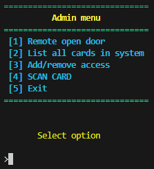
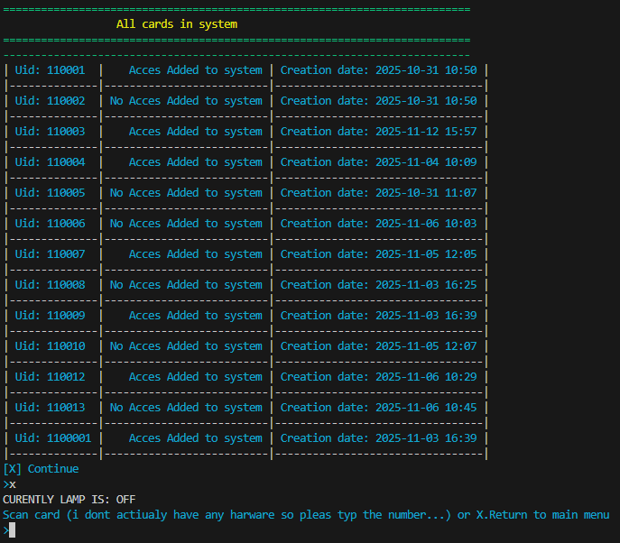

# Access Card Administration 

A terminal-based Access Card Administration program written in C (C++), designed to manage and control card-based access for a secure system.
The application allows administrators to add, remove, adjust, and list access cards, simulate remote door access, and handle card scanning through a text-based menu system.


## Features

- Add, remove, and modify card profiles
- Persistent encrypted data storage using Libsodium
- Data import feature with duplicate check
- Simulated card-scanning through terminal
- Safe input handling and buffer validation
- File read/write support through modular headers
- Time-delayed CLI feedback
- User-friendly interface
- Color-coded terminal interface
- Dynamic display of cardlist


## Screenshots

<div style="display: flex; justify-content: center; gap: 2%;">
  
  
</div>


## Project Structure
```bash
 Project/
├── src/                  # Source files
│   ├── main.c
│   ├── fileHandeling.c
│   ├── encryption.c
│   ├── addRemoveAcces.c
│   ├── printcards.c
│   ├── timeDelay.c
│   ├── remoteopen.c
│   ├── safeinput.c
│   ├── cardScan.c
│   ├── clearCls.c
│   └── colorpallet.c
├── includes/             # Header files
│   ├── menu.h
│   ├── fileHandeling.h
│   ├── encryption.h
│   ├── addRemoveAcces.h
│   ├── printcards.h
│   ├── timeDelay.h
│   ├── remoteopen.h
│   ├── safeinput.h
│   ├── cardScan.h
│   ├── clearCls.h
│   └── colorpallet.h
├── obj/                  # Object files (.o) generated by Makefile
├── Makefile              # Build instructions
├── data/                 # Card data storage
│   ├── data.enc          
│   └── import.txt        # add file to import data
└── README.md
```

## Data structures

#### Card
```bash
  typedef struct {
    int cardUid;
    int status;      // 0 = no access, 1 = access
    char date[20];   // "YYYY-MM-DD HH:MM"
} Card;

```
#### CARDLIST
```bash
  typedef struct {
    int amountOfCards;
    Card *allCards;   // dynamically allocated array of Card
} CARDLIST;

```

## Compilation & Execution
- Requirements

- GCC (GNU Compiler Collection)

- Libsodium library

- Run with Makefile 

- Compatible with Linux / macOS / Windows (MinGW) terminal

- For import, add/update import.txt file in data folder 

GCC compiler for windows:
https://www.msys2.org/

Libsodium library:
https://github.com/jedisct1/libsodium/releases?utm_source=chatgpt.com


## Data Encryption using Libsodium (Password-Protected Storage)

All card data is stored securely and privately using modern encryption provided by Libsodium.
A Stored file contains salt, nonce, ciphertext.
A 32-byte symmetric key is generated from the user password and salt using crypto_pwhash.
The system uses the symmetric key derived from a password to ensuring that only users who know the password can decrypt and access stored card profiles.


#### The data.enc file layout is

32 byte salt - 24 byte Nonce - Encrypted payload

### Authentication Flow 

####  Launch (no data.enc file)

- If no encrypted file exists:

- User is prompted to create and confirm a password

- Data is stored into a buffer

- Buffer is encrypted using the new password

- data.enc is created

- salt, nonce, and encrypted payload are stored.

####  Launch (data.enc exists)

- User must enter their password:

- If the password is wrong Decryption fails

- Plaintext buffer is not returned

- No partial data is leaked

- User is asked again

- Authentication only succeeds when the decrypted MAC tag validates properly.

### Code Example

Example: Full Save + Encrypt Cycle

```bash
  char *buffer;
  size_t len;

  buffer = wrightToFileBuffer(cardList, &len);

  if (encryptFile(buffer, len, "data.enc", password) != 0) {
      printf("Failed to store encrypted data!\n");
  }

  free(buffer);

```
Example: Full Load + Decrypt Cycle

```bash
  char *fileBuffer = NULL;
  size_t buffLength = 0;

  if (decryptFile(&fileBuffer, &buffLength, "data.enc", password) == 0) {
      readFromFileBuffer(fileBuffer, buffLength, &cardList);
      free(fileBuffer);
  }

```

## Memory Safety and Error Handeling
- Dynamic memory is allocated with mallock() and realloc.
- Memory is freed when cards are removed and when no cards remain.
- User input is strictly validated to prevent buffer owerflow.
- File operations check for faliures and handel errors.
- Numeric inputs are checked for range, type and owerflow.
- All finctions return clear INPUT_RESULT values for robust error handeling.


### Code examples

##### Dynamic UID Generation and Sorting
```bash
  cardList->allCards = realloc(cardList->allCards, (sizeof(Card) * (*amountOfCards +1)));
  if (!cardList->allCards) {
      perror("realloc failed");
      exit(EXIT_FAILURE);
  }
  int newCard = 110001; //startingpoint for card Uid
  int acces;
  int insertionPoint = *amountOfCards;

  if(*amountOfCards == 0){ 
      insertionPoint = 0;
      cardList ->allCards[insertionPoint].cardUid = newCard; // assign if no cards i system
  }else{    

      for(int i = 0; i < *amountOfCards; i++){ 
          if(cardList ->allCards[i].cardUid <= newCard){ //check all card Uid and increas new Uid untill uniqe
              newCard++;
          }else{ // when confirmed new Uid is uniq   
              break;
          }
      }   
  }
```
```bash
  int sortCardArray(CARDLIST *cardList, int *amountOfCards, int *newCard){
  int i = *amountOfCards - 1;

  while(i >= 0 && cardList->allCards[i].cardUid > *newCard){
      cardList->allCards[i + 1] = cardList->allCards[i];
      i--;
  }

  return i + 1;
}
```

Highlights

- Keeps the system the consistent and enures UID uniqueness.
- Avoids unnecessary memory use from using ex. buffer array.
- Avoids the need to re-sort the entire array after each insertion
- Efficiently insert new card while keeping the array sorted.


## Summary

This project demonstrates memory management, input validation and file persistence for an access control system.

- Modular design for easy maintenance and testing.
- Supports dynamic scaling of data.
- Emphasizes Safety operations and user-frendly interactions.
- Safe handling of mid-process cancellation.

Potential improvements

- Add concurrency support for scaning multiple cards in real-time.
- Proper hardware integation.
- Card Uid incryption.

## Author

 GitHub Profile
 raspants

## Memory Safety and Error Handeling
- Dynamic memory is allocated with mallock() and realloc.
- Memory is freed when cards are removed and when no cards remain.
- User input is strictly validated to prevent buffer owerflow.
- File operations check for faliures and handel errors.
- Numeric inputs are checked for range, type and owerflow.
- All finctions return clear INPUT_RESULT values for robust error handeling.


### Code examples

##### Dynamic UID Generation and Sorting
```bash
  cardList->allCards = realloc(cardList->allCards, (sizeof(Card) * (*amountOfCards +1)));
  if (!cardList->allCards) {
      perror("realloc failed");
      exit(EXIT_FAILURE);
  }
  int newCard = 110001; //startingpoint for card Uid
  int acces;
  int insertionPoint = *amountOfCards;

  if(*amountOfCards == 0){ 
      insertionPoint = 0;
      cardList ->allCards[insertionPoint].cardUid = newCard; // assign if no cards i system
  }else{    

      for(int i = 0; i < *amountOfCards; i++){ 
          if(cardList ->allCards[i].cardUid <= newCard){ //check all card Uid and increas new Uid untill uniqe
              newCard++;
          }else{ // when confirmed new Uid is uniq   
              break;
          }
      }   
  }
```
```bash
  int sortCardArray(CARDLIST *cardList, int *amountOfCards, int *newCard){
  int i = *amountOfCards - 1;

  while(i >= 0 && cardList->allCards[i].cardUid > *newCard){
      cardList->allCards[i + 1] = cardList->allCards[i];
      i--;
  }

  return i + 1;
}
```

Highlights

- Keeps the system the consistent and enures UID uniqueness.
- Avoids unnecessary memory use from using ex. buffer array.
- Avoids the need to re-sort the entire array after each insertion
- Efficiently insert new card while keeping the array sorted.


## Summary

This project demonstrates memory management, input validation and file persistence for an access control system.

- Modular design for easy maintenance and testing.
- Supports dynamic scaling of data.
- Emphasizes Safety operations and user-frendly interactions.
- Safe handling of mid-process cancellation.

Potential improvements

- Add concurrency support for scaning multiple cards in real-time.
- Proper hardware integation.
- Card Uid incryption.

## Author

 GitHub Profile
 raspants